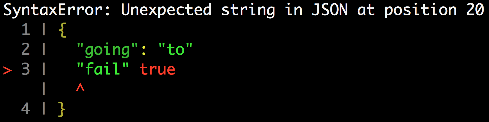

<h1 align="center">
  
</h1>

> Add the context of a json parse error to the error message with syntax highlighting if possible.

[](https://www.npmjs.com/package/json-parse-context)


## 📖 Table of Contents

* [Features](#-features)
* [API](#%EF%B8%8F-api)
* [Available Scripts](#-available-scripts)
* [Git Hooks](#-git-hooks)
* [Contributing](#-contributing)

<br />

## ✨ Features

### Example:

```javascript
const jsonParseContext = require('json-parse-context');

jsonParseContext(`{
  "going": "to"
  "fail" true
}`);
```



<br />

## 🎛️ API

`jsonParseContext(serialized [, reviver [, options]])`
* `serialized` (`String`): [serialized JSON](https://developer.mozilla.org/en-US/docs/Web/JavaScript/Reference/Global_Objects/JSON/parse#Parameters)
* `reviver` (`Function`): [prescribes how the value originally produced by parsing is transformed](https://developer.mozilla.org/en-US/docs/Web/JavaScript/Reference/Global_Objects/JSON/parse#Parameters)
* `options` (`Object`)
  * `lineCount` (`Number`) [_default: `2`_]: lines of context to add above and below the line with a syntax error

<br />

## 📜 Available Scripts

In the project directory, you can run:

**`npm run test:git-history`**

Validates commit messages using [`commitlint`](https://commitlint.js.org/)

**`npm run test:lint`**

Verifies that your code matches the American Express code style defined in [`eslint-config-amex`](https://github.com/americanexpress/eslint-config-amex).

**`npm run test:lockfile`**

Validates `package-lock.json` with [`lockfile-lint](https://www.npmjs.com/package/lockfile-lint)

**`npm run test:unit`**

Runs the unit tests using [`jest`](https://jestjs.io/) with the presets defined in
[`amex-jest-preset`](https://github.com/americanexpress/amex-jest-preset).

**`npm test`**

Runs all of the above `test:*` commands

<br />

## 🎣 Git Hooks

These commands will be automatically run during normal git operations like committing code.

**`pre-commit`**

This hook runs `npm test` before allowing a commit to be checked in.

**`commit-msg`**

This hook verifies that your commit message matches the One Amex conventions. See the **commit
message** section in the [contribution guidelines](./CONTRIBUTING.md).
 
 <br />

## 🏆 Contributing

See [contributing guidelines](./CONTRIBUTING.md)

<br />

## 🗝️ License

Any contributions made under this project will be governed by the [Apache License 2.0](https://github.com/americanexpress/json-parse-context/blob/main/LICENSE.txt).

<br />

## 🗣️ Code of Conduct

This project adheres to the [American Express Community Guidelines](https://github.com/americanexpress/json-parse-context/blob/main/CODE_OF_CONDUCT.md).
By participating, you are expected to honor these guidelines.
